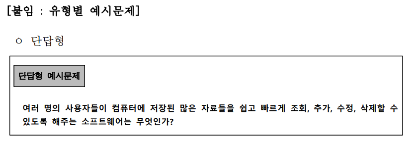
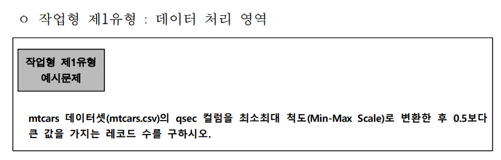
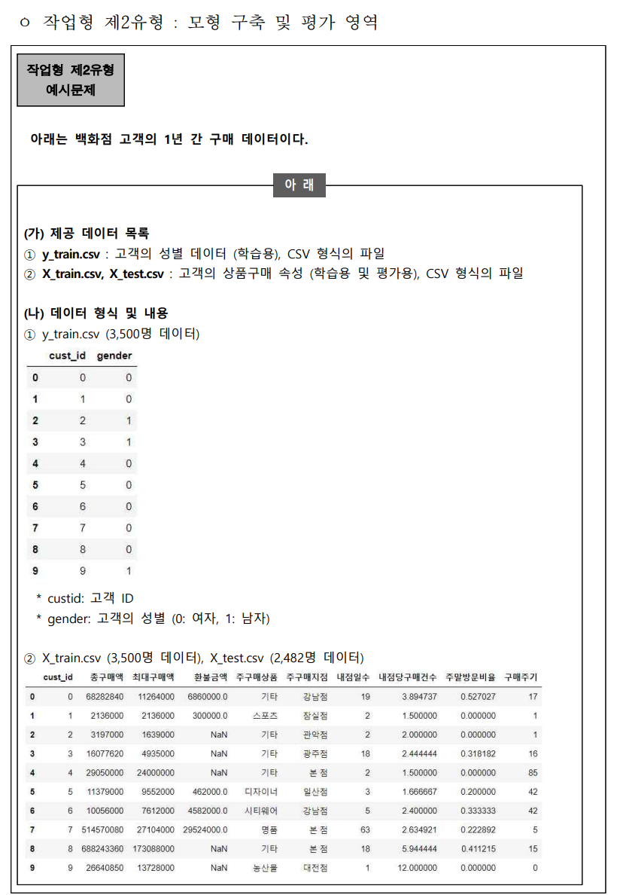
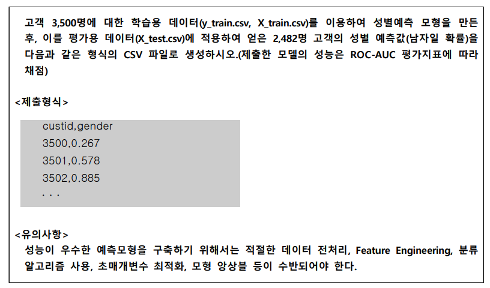

[패키지 리스트 확인 명령어]

import pkg_resources 
import pandas 
OutputDataSet = pandas.DataFrame(sorted([(i.key, i.version) for i in pkg_resources.working_set])) 
print(OutputDataSet)

[패키지 리스트]

0            asn1crypto           0.24.0
1        beautifulsoup4            4.9.3
2               certifi        2018.1.18
3               chardet            3.0.4
4                 cmake     3.18.4.post1
5          cryptography            2.1.4
6                cycler           0.10.0
7                cython          0.29.23
8                  idna              2.6
9                joblib            1.0.1
10              keyring           10.6.0
11         keyrings.alt              3.0
12           kiwisolver            1.3.1
13           matplotlib            3.3.4
14                numpy           1.19.5
15               pandas            1.1.5
16               pillow            8.2.0
17                  pip            9.0.1
18             pycrypto            2.6.1
19            pygobject           3.26.1
20            pyparsing            2.4.7
21           python-apt  1.6.5+ubuntu0.5
22      python-dateutil            2.8.1
23                 pytz           2021.1
24                pyxdg             0.25
25             requests           2.18.4
26         scikit-learn           0.24.1
27                scipy            1.5.4
28        secretstorage            2.3.1
29             selenium          3.141.0
30           setuptools           39.0.1
31                  six           1.11.0
32            soupsieve            2.2.1
33        ssh-import-id              5.7
34        threadpoolctl            2.1.0
35  unattended-upgrades              0.1
36              urllib3             1.22
37                wheel           0.30.0
38              xgboost            1.4.1

